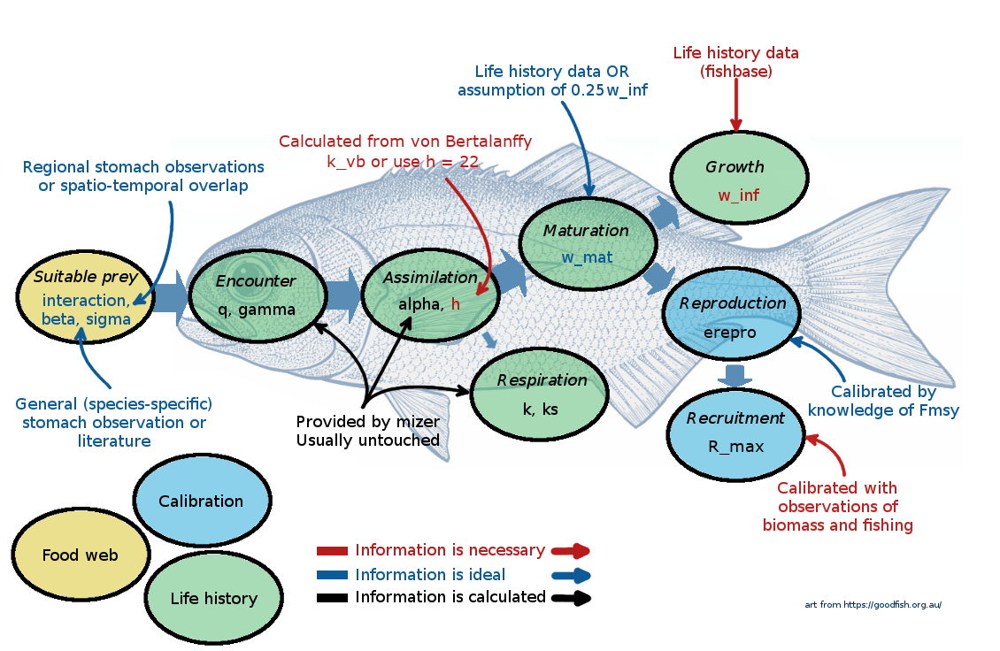

# mizerHowTo 

This package contains several tutorials aiming to learn how to handle
mizer models and to be able to calibrate mizer models with empirical
data.

## Installation

The `remotes` package is needed to install packages hosted on GitHub.

``` r
install.packages("remotes")
remotes::install_github("sizespectrum/mizerHowTo")
```

Finally, load the newly installed package with

``` r
library(mizerHowTo)
```

To display any tutorial, use the `tutorial()` function.

Available tutorials are

-   HTM0: Examples on the use of Mizer

-   HTM1: How to parametrise a Mizer model the first time

-   HTM2: How to refine the calibration of your model

-   HTM3: How to calibrate using time series

Examples:

`tutorial("HTM1","html")` will display the online version of the first
tutorial.

`tutorial("HTM2","Rmd")` will display the code of the second tutorial.

Several shiny apps (R code with user interface) are embedded in the
tutorials. One can start them from the Rmarkdown files (.Rmd) by running
the appropriate chunk of code. All shiny apps functions follows this
expression `shiny_XXX()`.


